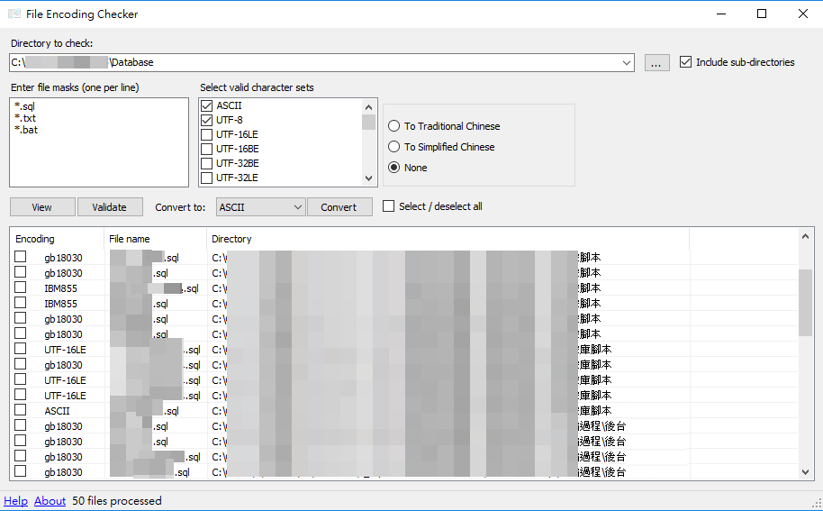

# File Encoding Checker

Clone from [https://encodingchecker.codeplex.com/](https://encodingchecker.codeplex.com/)

- Add Simplified Chinese to Traditional Chinese.
- Add Traditional Chinese to Simplified Chinese.

## Project Description

File Encoding Checker is a GUI tool that allows you to validate the text encoding of one or more files. The tool can display the encoding for all selected files, or only the files that do not have the encodings you specify.
File Encoding Checker requires .NET 2 or above to run.

Known issues

There are a few known issues that we are working on fixing for the v1.1 release:
Sorting the results by a column does not work
Entering nothing in the file masks field is not handled property. This should have defaulted the file mask to *.*.
Program settings are currently stored in the executable's directory. This does not work well with ClickOnce applications and should be changed to the data directory.
Credits

For encoding detection, File Encoding Checker uses the [ude library](http://code.google.com/p/ude), which is a C# port of the [Mozilla Universal Charset Detector](http://mxr.mozilla.org/mozilla/source/extensions/universalchardet/src) library.
Last edited Jan 21, 2011 at 4:39 PM by [jeevanjj](https://www.codeplex.com/site/users/view/jeevanjj), version 8

## ChangeLog
2016-09-22
* Add translate Simplified Chinese to Traditional Chinese.
* Add translate Traditional Chinese to Simplified Chinese.
